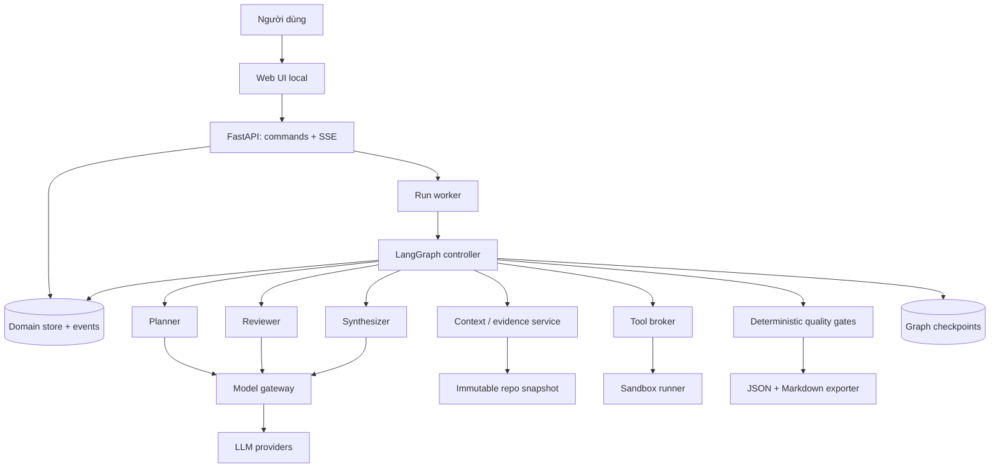

# Kế hoạch thiết kế kiến trúc Astra Multi

> Phiên bản: 0.1 — 01/10/2026
>
> Trạng thái: đề xuất kiến trúc để triển khai; các đánh giá framework dựa trên tài liệu chính thức, chưa phải kết quả benchmark hoặc thử nghiệm tích hợp.

## 1. Mục tiêu và phạm vi

### 1.1 Mục tiêu

Xây dựng môi trường cho nhiều LLM coding cùng giải quyết một nhiệm vụ thiết kế phần mềm, có khả năng:

1. Hiểu cùng yêu cầu và cùng phiên bản mã nguồn.
2. Phân tích độc lập trước khi đọc đề xuất của nhau.
3. Phản biện cụ thể theo vấn đề, sử dụng bằng chứng truy vết được.
4. Kiểm chứng bất đồng bằng công cụ hoặc hỏi người dùng khi thiếu quyết định sản phẩm.
5. Tạo kế hoạch đủ rõ để coding agent khác thực thi.
6. Tạm dừng, tiếp tục, giới hạn ngân sách và giữ lịch sử quyết định.

Chất lượng được đo bằng độ đúng, độ bao phủ yêu cầu và mức độ thực thi được, không đo bằng số lượt chat hoặc số model đồng ý.

### 1.2 Phạm vi MVP

- Local-first, một người dùng; một run hoạt động tại một thời điểm, các lời gọi model trong run có thể song song.
- Nhập yêu cầu và đường dẫn repo tùy chọn.
- Ba vai trò LLM: Planner, Reviewer, Synthesizer; controller bằng code quản lý luồng.
- Cấu hình model theo vai trò, hỗ trợ tối thiểu hai provider qua adapter được kiểm thử.
- Đọc/tìm kiếm repo snapshot và thực hiện kiểm chứng giới hạn trong sandbox.
- Hiển thị tiến trình, issue, evidence, decision, chi phí và phiên bản plan.
- Xuất Markdown và JSON cùng nội dung nghiệp vụ.
- Hỏi thêm khi thiếu thông tin quan trọng; resume sau câu trả lời hoặc sau lỗi tiến trình.

### 1.3 Hướng mở rộng sau MVP

- Adapter cho coding CLI/harness nếu người dùng muốn tái sử dụng agent đã có.
- Vai trò Investigator hoặc Validation Reviewer riêng khi benchmark chứng minh có lợi.
- Nhiều người dùng, nhiều run đồng thời, worker phân tán.
- Bộ nhớ giữa các dự án, tìm kiếm semantic khi tìm kiếm thông thường không đủ.
- Thực thi kế hoạch thành code là một giai đoạn sản phẩm riêng, dùng hợp đồng plan đã định nghĩa.

## 2. Yêu cầu và tiêu chí kiến trúc

| ID | Yêu cầu | Cách nghiệm thu |
|---|---|---|
| REQ-01 | Chuẩn hóa mục tiêu, phạm vi, ràng buộc, acceptance criteria | Mỗi run có TaskSpec hợp lệ và version |
| REQ-02 | Cùng dữ kiện gốc | Mọi evidence về code gắn snapshot ID/hash |
| REQ-03 | Phân tích độc lập | Prompt vòng đầu của Reviewer không chứa output Planner |
| REQ-04 | Phản biện cụ thể | Issue có claim, ảnh hưởng, căn cứ hoặc yêu cầu xác minh, hướng xử lý |
| REQ-05 | Giải quyết bất đồng có căn cứ | Issue blocking không thể đóng chỉ bằng biểu quyết |
| REQ-06 | Plan có thể thực thi | Mỗi requirement có step và validation; dependency không có chu trình |
| REQ-07 | Truy vết | Requirement → step → validation; claim → evidence; decision → alternatives |
| REQ-08 | Có thể khôi phục | Restart không mất issue/decision đã commit; không nhân đôi bản plan |
| REQ-09 | Có giới hạn | Budget, deadline, round limit được kiểm soát trước khi gọi tool/model |
| REQ-10 | Hỗ trợ nhiều model | Thay model bằng cấu hình, domain model không phụ thuộc SDK provider |
| REQ-11 | Không hợp thức hóa thiếu thông tin | Hết ngân sách khi còn blocker tạo partial plan có lý do |
| REQ-12 | Đầu ra nhất quán | Markdown render từ JSON canonical đã qua validation |

## 3. Kiến trúc có sẵn: đánh giá và quyết định tái sử dụng

### 3.1 Đối chiếu framework

| Lựa chọn | Khả năng theo tài liệu đã xem | Độ phù hợp với Astra Multi | Quyết định |
|---|---|---|---|
| LangGraph | Stateful graph, persistence, streaming, interrupt, kết hợp logic xác định với LLM | Phù hợp để biểu diễn các pha, vòng phản biện có giới hạn và checkpoint | Đề xuất làm orchestration runtime |
| AutoGen AgentChat | Agents, teams, selector group chat, state, termination và graph workflows | Phù hợp với giao tiếp multi-agent; vẫn cần thiết kế evidence ledger và quality gate | Phương án thay thế nếu spike chứng minh tích hợp tốt hơn |
| CrewAI Flows | Event-driven flow, structured state, routing, persistence và human feedback | Phù hợp role/task workflow; nghiệp vụ hội tụ và provenance vẫn cần xây | Phương án thay thế, không ghép thêm vào runtime MVP |
| Tự viết toàn bộ runtime | Toàn quyền kiểm soát | Tốn công cho resume, checkpoint, streaming và lỗi phân tán | Chỉ xem xét nếu framework không vượt qua spike |

Không có đủ bằng chứng rằng một giải pháp trong bảng đáp ứng trọn vẹn tất cả REQ-01…12 ngay khi cài đặt. Vì vậy, tái sử dụng các primitive phù hợp, không mặc định lấy nguyên một ứng dụng group chat làm kiến trúc hoàn chỉnh.

### 3.2 Mẫu kiến trúc được kết hợp

- **State machine / workflow graph:** điều khiển các pha và điều kiện chuyển trạng thái.
- **Blackboard:** bộ dữ liệu chung có cấu trúc cho facts, assumptions, issues, decisions, plan.
- **Proposer–critic–synthesizer:** phân công rõ đề xuất, phản biện và tổng hợp.
- **Ports and adapters:** thay provider LLM, storage và sandbox mà không đổi nghiệp vụ.
- **Append-only audit log + versioned artifacts:** theo dõi thay đổi, không cần xây hệ thống event sourcing đầy đủ trong MVP.

### 3.3 Điều kiện chấp nhận LangGraph trước khi khóa stack

Spike phải chứng minh: fan-out phân tích độc lập, fan-in có thứ tự ổn định, checkpoint trên đĩa, interrupt/resume, bounded loop, stream event, adapter nhiều provider và recovery sau kill tiến trình. Kiểm tra version, giấy phép, maintenance và tương thích Python/Windows tại thời điểm cài; pin dependency bằng lockfile sau spike.

## 4. Kiến trúc tổng thể



### 4.1 Stack đề xuất

| Thành phần | MVP | Lý do |
|---|---|---|
| Backend/domain | Python + Pydantic + FastAPI | Typed contracts, API và tích hợp hệ sinh thái agent |
| Orchestration | LangGraph | Graph tường minh và persistence |
| Provider integration | Adapter mỏng dùng SDK provider | Kiểm soát capability, usage và lỗi; tránh phụ thuộc định dạng chung giả định |
| Domain persistence | SQLite, migrations có version | Đủ cho local single-user; domain write qua một writer |
| Checkpoint | SQLite checkpointer tương thích version LangGraph đã chọn | Lưu trạng thái graph bền vững |
| Artifact storage | Filesystem trong workspace của ứng dụng | Snapshot, evidence output lớn, export |
| Frontend | React + TypeScript + Vite | Hiển thị timeline, bảng issues, plan diff |
| Streaming | Server-Sent Events | Luồng server → UI, reconnect theo event ID |
| Kiểm chứng code | Container qua Docker Desktop/WSL2 cho target Linux | Cô lập lệnh, timeout và quota |
| Windows-specific target | Runner Windows VM/remote riêng khi cần | Container Linux không chứng minh tính đúng trên Windows |

Controller là code xác định trạng thái, không phải LLM tự cấp quyền chuyển pha. Synthesizer đề nghị quyết định; validation service mới commit thay đổi hợp lệ.

### 4.2 Ranh giới thành phần

- API nhận command, lưu run, trả run ID; không giữ một HTTP request đến hết cuộc thảo luận.
- Worker chạy workflow, giữ lease run có heartbeat để tránh hai worker xử lý cùng run.
- Model gateway quản lý capability, retry, timeout, usage, model ID thực tế và schema output.
- Context service tạo context theo vai trò và phase, kiểm soát kích thước và provenance.
- Tool broker cấp các tool hẹp: list/read/search, inspect dependencies, run configured checks, fetch documentation.
- Domain service quản lý revision, rules đóng issue, budget và gate kết thúc.
- Exporter chỉ dùng plan JSON canonical, không gọi thêm LLM để viết lại nội dung sau gate.

## 5. Vai trò và giao thức thảo luận

### 5.1 Trách nhiệm

| Vai trò | Đầu vào | Đầu ra | Quyền cập nhật |
|---|---|---|---|
| Planner | TaskSpec, snapshot context, evidence | IndependentAnalysis, Proposal, PlanRevision | Đề nghị thay đổi, không ghi trực tiếp canonical plan |
| Reviewer | Cùng dữ kiện; chưa thấy proposal ở pha độc lập | RiskAnalysis; sau đó ReviewIssues | Đề nghị issue và xác nhận xử lý |
| Synthesizer | Các phân tích, proposal, issue và kết quả xác minh | DecisionProposal, PlanCandidate | Đề nghị hợp nhất và giải thích trade-off |
| Controller | State, budget, rules | Tool jobs, transitions, committed revisions | Writer duy nhất qua domain service |

Một model có thể phục vụ nhiều vai trò nhưng phải là các invocation/context tách biệt. Ưu tiên thử ít nhất hai model khác nhau cho Planner và Reviewer; chỉ giữ cấu hình này nếu hiệu quả đo được xứng đáng với chi phí.

### 5.2 Luồng một run

1. **INTAKE:** tạo TaskSpec, chia requirement có ID và acceptance criteria; ghi rõ unknowns.
2. **SNAPSHOT:** đóng băng repo; nếu xây mới thì lưu constraints và đánh dấu greenfield.
3. **INVESTIGATE:** công cụ thu thập cấu trúc, dependencies, test commands; facts phải có nguồn.
4. **INDEPENDENT_ANALYSIS:** Planner và Reviewer phân tích cùng baseline độc lập, chưa nhìn output của nhau.
5. **PROPOSE:** Planner đưa phương án khuyến nghị; nêu alternative ở quyết định có trade-off thực sự.
6. **REVIEW:** Reviewer kiểm tra feasibility, requirement coverage, rủi ro, giả định và validation; tạo issues có ID.
7. **VERIFY:** controller chuyển tranh luận về dữ kiện thành tool job; kết quả cập nhật evidence ledger.
8. **REVISE:** Planner sửa; Synthesizer ghi quyết định và tạo candidate mới.
9. **QUALITY_GATE:** kiểm tra cấu trúc bằng code và semantic review; nếu còn vấn đề thì lặp có giới hạn.
10. **EXPORT:** ghi plan JSON/Markdown, decision log, evidence index, remaining questions và usage.

Mọi bước có thể chuyển sang WAITING_FOR_INPUT khi cần thông tin của người dùng, hoặc kết thúc PARTIAL/FAILED/CANCELLED với lý do.

### 5.3 Cấu trúc thông điệp

```json
{
  "message_id": "MSG-001",
  "run_id": "RUN-001",
  "phase": "REVIEW",
  "role": "reviewer",
  "type": "issue_proposal",
  "based_on_revision": 3,
  "content": {
    "issue_id": "ISSUE-001",
    "requirement_ids": ["REQ-002"],
    "claim": "Phương án migration chưa tương thích ứng dụng cũ",
    "severity": "blocking",
    "evidence_ids": ["EVD-004"],
    "suggested_resolution": "Chia migration thành expand/migrate/contract",
    "verification": "Chạy integration check với ứng dụng cũ trên schema chuyển tiếp"
  }
}
```

Schema sai: một lần sửa output có giới hạn, sau đó lỗi rõ ràng hoặc PARTIAL tùy pha. Không diễn giải text không hợp lệ thành một quyết định đã được duyệt.

### 5.4 Giải quyết bất đồng

| Loại bất đồng | Cách xử lý |
|---|---|
| Dữ kiện về repo | Read/search/test gắn snapshot; ưu tiên kết quả tái hiện được |
| Hiệu năng | Benchmark nhỏ có điều kiện đo; chưa đo thì giữ assumption |
| Thiết kế | So sánh theo constraints, độ đơn giản, operability và reversibility |
| Sản phẩm hoặc quyền thêm dependency | Hỏi người dùng khi câu trả lời thay đổi đáng kể plan |
| Không thể kiểm chứng trong ngân sách | Ghi unknown/blocker; xuất PARTIAL nếu ảnh hưởng khả thi |

Issue lifecycle: open → investigating → proposed_resolution → resolved; có rejected/duplicate kèm lý do và liên kết. Issue blocking chỉ đóng sau khi có resolution hợp lệ và reviewer kiểm tra trên revision mới, hoặc người dùng sửa yêu cầu làm issue không còn áp dụng. Không tự hạ severity để vượt gate.

### 5.5 Ngân sách và hội tụ

Mặc định đề xuất để thử nghiệm: tối đa hai vòng review/revise, concurrency LLM = 2, timeout một call = 120 giây, tối đa hai retry transient có backoff/jitter. Đây là tham số khởi đầu, cần chỉnh theo model và benchmark.

- Người dùng cấu hình deadline, token budget và cost budget theo run.
- Trước mỗi call, reserve chi phí tối đa ước tính từ input + giới hạn output; các call song song dùng chung reservation ledger.
- Reconcile theo usage provider; nếu không có giá/usage chính xác thì ghi estimate, không tuyên bố bảo đảm mức tiền tuyệt đối. Token/call limits vẫn cưỡng chế được.
- Retry cũng tiêu ngân sách; reserve phần còn lại cho xuất partial artifact.
- Stagnation: cùng issue xuất hiện sau một vòng đầy đủ mà không có evidence/resolution mới → hỏi người dùng hoặc xuất PARTIAL.
- Dừng thành công khi gates đạt; không bắt buộc tiêu hết số vòng.

## 6. Shared state và dữ liệu

### 6.1 Các entity chính

| Entity | Trường thiết yếu |
|---|---|
| TaskSpec | id, revision, goal, requirements, constraints, non_goals, acceptance_criteria, unknowns |
| Run | id, task_revision, snapshot_id, phase, status, stop_reason, config_hash, budget, timestamps |
| Snapshot | id, source_path, commit_if_any, manifest_hash, file_hashes, excluded_patterns |
| Claim | id, text, kind=fact/assumption/proposal/unknown, evidence_ids, snapshot_id |
| Evidence | id, source_type, locator, content_hash, captured_at, tool_call_id, snapshot_id, status |
| Proposal | id, author_role, base_revision, approach, alternatives, tradeoffs, claim_ids |
| Issue | id, severity, status, requirement_ids, evidence_ids, resolution, reviewed_revision |
| Decision | id, question, alternatives, chosen, rationale, evidence_ids, related_issues |
| PlanRevision | id, revision, based_on_revision, requirements_revision, snapshot_id, steps, risks, decisions |
| PlanStep | id, objective, targets, dependencies, requirement_ids, deliverables, validation, completion_criteria |
| ToolCall | id, request_hash, arguments_redacted, environment, exit_code, output_artifact, timing |
| ModelCall | id, role, provider, model_id, prompt_version, input_hash, usage, estimated_cost, attempts |
| Event | id, run_id, sequence, type, actor, payload_ref, timestamp |

Evidence chỉ chứng minh nội dung trong phạm vi của nó: tìm thấy một hàm không chứng minh runtime hoạt động; test chưa chạy phải ghi NOT_RUN thay vì PASS. Khi validation được thực thi, lưu expected/actual và exit code.

### 6.2 Quy tắc lưu và hợp nhất

- Agent gửi proposal hoặc delta; một writer kiểm tra schema và base revision rồi commit.
- Cập nhật lỗi thời bị từ chối và yêu cầu rebase trên revision hiện tại.
- Parallel node ghi kết quả riêng theo role/call ID; reducer hợp nhất có thứ tự ổn định, không ghi đè chuỗi văn bản tự do.
- Ghi domain mutation và event trong cùng transaction SQLite.
- Graph checkpoint là trạng thái thực thi; domain store là nguồn chuẩn cho artifact và quyết định. Không duy trì hai bản plan độc lập.
- Checkpoint tham chiếu domain revision. Node commit dùng idempotency key `(run_id, node, logical_operation_id)`.
- Khi crash giữa domain commit và checkpoint, node chạy lại đọc operation đã commit thay vì tạo revision mới.
- External call có thể bị lặp nếu crash sau response nhưng trước persist; không cam kết exactly-once với provider. Tool có side effect phải sandbox và thiết kế idempotent hoặc yêu cầu đối soát.

### 6.3 Snapshot và freshness

Repo Git: ghi commit, trạng thái dirty và snapshot chứa nội dung dirty được chọn. Commit hash đơn lẻ không đủ mô tả working tree đã thay đổi. Repo không Git: tạo manifest/hash nội dung. Loại secrets, build output và dependencies theo cấu hình; hiển thị phần loại bỏ để người dùng biết phạm vi khảo sát.

Repo thay đổi không làm thay đổi snapshot của run đang chạy. Khi người dùng yêu cầu cập nhật code mới, tạo run/snapshot mới, liên kết run cũ và đánh dấu evidence phụ thuộc file thay đổi cần xác minh lại.

### 6.4 Context management

- Vòng đầu: TaskSpec + cùng repo map + cùng evidence baseline; giữ kín phân tích giữa các vai trò.
- Vòng sau: plan revision hiện tại + open issues + decision summary + evidence liên quan.
- Không gửi toàn bộ transcript ở mọi lượt; lưu transcript để tra cứu khi cần.
- Tóm tắt phải giữ ID và liên kết nguồn; facts không được hình thành chỉ vì xuất hiện trong summary.
- Tách context theo run; kiến thức cũ chỉ được tái dùng với provenance và kiểm tra freshness.

## 7. Model gateway và tool execution

### 7.1 Model contract

Interface dự kiến: `generate(role, messages, output_schema, tool_specs, limits) -> ModelResult`.

Capability registry mô tả structured output, tool calling, context limit, usage support. Model không hỗ trợ JSON schema native vẫn có thể dùng JSON parsing/validation có retry giới hạn; không giả định mọi API OpenAI-compatible có hành vi giống nhau.

Lưu model/provider thực tế sau fallback. Không đổi provider âm thầm nếu cấu hình project giới hạn nơi dữ liệu được gửi. Tách lỗi rate limit, timeout, auth, context overflow và schema; lỗi auth không retry theo backoff như lỗi tạm thời.

### 7.2 Tool contract và môi trường

- Đường dẫn được resolve trong snapshot root, chặn path traversal và symlink/junction thoát root.
- Read/search có output limit; phần bị cắt được ghi rõ và có thể lấy tiếp theo range.
- Lệnh test chạy trên bản copy/sandbox, không chạy trực tiếp trên repo nguồn.
- Chỉ mount snapshot cần thiết; không đưa API key hoặc filesystem cá nhân vào sandbox.
- Network, CPU/RAM, runtime và output size được cấu hình theo tool profile.
- Native host subprocess không được gọi là sandbox an toàn cho code không tin cậy.
- Nếu sandbox không có sẵn, run vẫn phân tích bằng read/search nhưng ghi rõ kiểm chứng executable chưa chạy; khả năng ảnh hưởng đến gate tùy issue.
- Nội dung file/web/log là dữ liệu, không được thay đổi system rules, tool scope hoặc budget.

## 8. API và trải nghiệm sử dụng

### 8.1 API dự kiến

| Endpoint | Công dụng |
|---|---|
| POST /api/runs | Tạo TaskSpec/run, trả 202 + run ID; hỗ trợ idempotency key |
| GET /api/runs/{id} | Trạng thái, phase, budget và revision |
| GET /api/runs/{id}/events | SSE; replay từ Last-Event-ID rồi theo dõi mới |
| GET /api/runs/{id}/issues | Issues và trạng thái giải quyết |
| GET /api/runs/{id}/evidence | Evidence index |
| GET /api/runs/{id}/plans/{revision} | Plan JSON canonical |
| POST /api/runs/{id}/answers | Trả lời câu hỏi đang chờ, kèm question ID và expected revision |
| POST /api/runs/{id}/resume | Resume trạng thái cho phép; tránh chạy trùng |
| POST /api/runs/{id}/cancel | Hủy run, dừng lập lịch và cố gắng dừng tool/call đang chạy |
| GET /api/runs/{id}/export?format=md | Tải bản kế hoạch theo revision |

Định nghĩa lỗi có code và correlation ID: invalid_state, revision_conflict, budget_exhausted, provider_unavailable, snapshot_missing. SSE chỉ là kênh quan sát, mất kết nối UI không làm hủy run.

### 8.2 Giao diện

1. **New run:** yêu cầu, repo, ràng buộc, model theo vai trò, budget.
2. **Run overview:** phase, thời gian, chi phí, câu hỏi cần trả lời.
3. **Discussion:** các phát biểu công khai của agent, gắn issue/decision; không yêu cầu hoặc lưu suy luận nội bộ ẩn.
4. **Evidence:** source, snapshot, tool result và trạng thái kiểm chứng.
5. **Plan:** phiên bản hiện tại, diff với bản trước, coverage và dependency graph.
6. **Export:** FINAL hoặc PARTIAL, lý do, questions và các bước tiếp theo.

Local MVP bind loopback. API xác thực session/token local và giới hạn origin; cấu hình secrets chỉ ở backend, log được redaction. Khi mở dùng từ xa phải thiết kế authentication và project isolation tương ứng trước khi triển khai.

## 9. Quality gates và hợp đồng đầu ra

### 9.1 Gate kiểm tra bằng code

- TaskSpec và PlanRevision đúng schema.
- ID tham chiếu tồn tại; không trùng ID.
- Mọi requirement trong phạm vi có step và acceptance validation.
- Step có objective, deliverable, dependency, validation và completion criteria.
- Dependency là DAG; thứ tự thực hiện hợp lệ.
- Không còn blocking issue chưa xử lý.
- Claim quan trọng về repo có evidence phù hợp snapshot; thiếu nguồn phải là assumption/unknown.
- Không có validation bị ghi PASS khi chưa thực thi.
- Mọi câu hỏi ảnh hưởng kiến trúc đã có câu trả lời hoặc quyết định xử lý hợp lệ.

### 9.2 Gate đánh giá ngữ nghĩa

Reviewer đánh giá: feasibility, độ cụ thể, test có chứng minh đúng requirement không, migration/compatibility khi liên quan, và độ phức tạp so với mục tiêu. JSON hợp lệ và coverage bằng ID không đủ chứng minh tính đúng. Semantic review cũng có thể sai, nên benchmark và kiểm chứng tool vẫn cần thiết.

### 9.3 Trạng thái đầu ra

- **FINAL:** đạt gates với assumptions còn lại không chặn thực thi và được nêu rõ. FINAL nghĩa là sẵn sàng bàn giao thực hiện, không phải bảo đảm code tương lai sẽ đúng.
- **PARTIAL:** có artifact hữu ích nhưng còn blocker, hết budget/deadline hoặc đình trệ; ghi rõ lý do và hành động cần tiếp.
- **WAITING_FOR_INPUT:** có câu hỏi cụ thể; lưu draft/checkpoint để resume.
- **FAILED:** lỗi hệ thống làm run không thể hoàn thành; giữ các artifact đã commit.
- **CANCELLED:** người dùng dừng; giữ lịch sử và không đánh dấu draft thành FINAL.

Mẫu đầu ra chi tiết nằm trong [PLAN_TEMPLATE.md](PLAN_TEMPLATE.md).

## 10. Cấu trúc mã nguồn dự kiến

```text
Astra multi/
  README.md
  PLAN.md
  PLAN_TEMPLATE.md
  backend/
    pyproject.toml
    src/astra_multi/
      api/                  # HTTP, SSE, request schemas
      domain/               # entities, policies, gate rules
      orchestration/        # graph, nodes, routing, reducers
      agents/               # role contracts, versioned prompts
      providers/            # adapters, capabilities, usage
      context/              # snapshot, retrieval, context builder
      tools/                # read/search/verify interfaces
      sandbox/              # execution backends
      persistence/          # repositories, migrations, idempotency
      exports/              # canonical JSON -> Markdown
      observability/        # events, redaction, metrics
    tests/
      unit/
      integration/
      recovery/
      fixtures/
  frontend/
    src/
  evaluations/
    tasks/
    rubrics/
    results/
  docs/
    adr/
  .local/                   # ignored: DB, snapshots, outputs
```

Đây là cấu trúc để triển khai trong tương lai; hiện tại chỉ tạo bộ tài liệu kế hoạch.

## 11. Lộ trình triển khai theo dependency

Bản chia nhỏ cho dev agent: [IMPLEMENTATION_PLAN.md](IMPLEMENTATION_PLAN.md). Các plan P0–P6 trong [plans/](plans/) giữ nguyên roadmap bên dưới và bổ sung task ID, dependency, contract, kiểm chứng và exit gate. Tiến độ thực tế theo dõi tại [IMPLEMENTATION_STATUS.md](IMPLEMENTATION_STATUS.md).

Ước lượng dưới đây dành cho một developer quen stack, làm việc tập trung, chưa gồm thời gian chờ API hoặc yêu cầu thay đổi. Cần hiệu chỉnh sau spike; không phải cam kết lịch.

| Phase | Phụ thuộc | Công việc và đầu ra | Điều kiện hoàn thành | Ước lượng |
|---|---|---|---|---|
| P0 — Khóa yêu cầu và spike | Không | Xác nhận assumptions; ADR chọn framework; mini graph 2 provider, fan-out/fan-in, interrupt, checkpoint | Demo recovery, bounded loop, structured output; pin version | 2–3 ngày |
| P1 — Domain và persistence | P0 | Schemas, SQLite migrations, writer, event log, revision và idempotency | Restart không mất committed mutation; stale update bị reject | 3–4 ngày |
| P2 — Snapshot và tools | P1 | Snapshot service, read/search, evidence ledger, sandbox adapter | Dirty/non-Git snapshot đúng; path escape bị chặn; test evidence tái hiện được | 3–5 ngày |
| P3 — Model gateway và workflow | P1; tích hợp P2 | Role prompts, independent analysis, review loop, questions, budgets và retry | Chạy đủ happy path/partial/waiting; không phát sinh loop vô hạn | 4–6 ngày |
| P4 — Gates và export | P3 | Coverage validator, DAG check, issue resolution, semantic review, Markdown renderer | Không FINAL khi blocker còn mở; JSON/Markdown nhất quán | 2–3 ngày |
| P5 — API và UI | P4 | API, SSE reconnect, timeline, issue/evidence view, answers, diff, export | Người dùng chạy và resume được một nhiệm vụ end-to-end | 4–6 ngày |
| P6 — Evaluation và hardening | P5 | Baseline benchmark, fault injection, usage reporting, setup docs | Đạt tiêu chí pilot ở mục 12; công bố hạn chế còn lại | 3–5 ngày |

Tổng định hướng: 21–32 ngày công. P2 và phần provider của P3 có thể triển khai song song khi có thêm developer; chúng vẫn phải thống nhất contract từ P1.

### 11.1 Thứ tự công việc đầu tiên

1. Chốt cách gọi LLM: API trước hay coding CLI bắt buộc.
2. Chọn hai provider/model có quyền truy cập và budget thử nghiệm.
3. Viết schemas TaskSpec, Issue, Evidence, PlanRevision và bộ fixture nhỏ.
4. Spike LangGraph: independent analysis → review → interrupt/resume → export.
5. Kill worker tại điểm giữa domain commit/checkpoint để kiểm tra idempotency.
6. Chốt ADR-001 rồi mới dựng phần ứng dụng còn lại.

### 11.2 ADR dự kiến

- ADR-001: chọn runtime sau spike.
- ADR-002: domain store canonical, graph checkpoint và cơ chế recovery.
- ADR-003: independent analysis và bounded critique thay cho chat tự do.
- ADR-004: provider capability contract và fallback.
- ADR-005: snapshot semantics và sandbox theo target OS.
- ADR-006: tiêu chí FINAL/PARTIAL và budget accounting.

## 12. Kế hoạch xác minh và đánh giá hiệu quả

### 12.1 Test có ý nghĩa đối với kiến trúc

| Nhóm | Tình huống | Kết quả mong đợi |
|---|---|---|
| Domain | Step dependency cycle, missing requirement, reference sai | Gate reject với lỗi cụ thể |
| Review | Agent nói đồng ý nhưng blocker chưa có resolution | Không FINAL |
| Independence | Gắn marker vào Planner output vòng đầu | Marker không xuất hiện trong Reviewer input vòng đầu |
| Provenance | Repo dirty, file đổi, evidence cũ | Snapshot chính xác; evidence cũ không dùng như fact mới |
| Recovery | Kill trước/sau commit, trước/sau checkpoint | Resume đúng revision, không trùng issue/plan |
| Provider | 429, timeout, auth error, invalid JSON, context overflow | Retry đúng loại, có giới hạn và trace |
| Budget | Hai call cùng reserve, retry, usage thiếu | Không vượt reservation đã cấu hình; estimate hiển thị rõ |
| Tool isolation | Path traversal, junction escape, prompt injection trong README | Không thoát tool scope hoặc thay đổi controller policy |
| Sandbox | Test treo, output quá lớn, thiếu Docker | Timeout/truncate rõ ràng; không ghi test chưa chạy là PASS |
| UI/API | SSE reconnect, gửi answer trùng, cancel | Replay không mất event; idempotent command; dừng lập lịch |
| Export | Thay revision khi người dùng tải | Export gắn revision cố định, nội dung khớp JSON |

### 12.2 Benchmark so với một model

Tạo tối thiểu 12 nhiệm vụ pilot, phân bổ: bug fix, feature, refactor, migration, yêu cầu mơ hồ và greenfield. Chạy mỗi cấu hình ba lần nếu ngân sách cho phép.

So sánh:

- Baseline một model với cùng tools, snapshot và tổng token/cost cap tương đương.
- Astra Multi theo cấu hình đề xuất.
- Chấm ẩn tên cấu hình, cùng rubric; ưu tiên reviewer con người cho mẫu pilot.

Rubric 0–4 cho: correctness, completeness, executability, evidence quality, proportionality. Báo median/range, tỷ lệ critical omission, tỷ lệ phải re-plan, latency, tokens và cost. Thực thi ít nhất bốn kế hoạch đại diện trong môi trường thử nghiệm để đo mức phải điều chỉnh; không chỉ dùng LLM chấm LLM.

Ngưỡng pilot đề xuất, cần chốt tại P0:

- 100% FINAL artifacts qua structural gates; zero FINAL với unresolved blocker trong fixture tests.
- Không mất committed artifact hoặc duplicate canonical revision trong recovery tests.
- Điểm chất lượng trung bình ít nhất bằng baseline, critical omission không tăng và ít nhất một cải thiện đo được: giảm omission, tăng executability hoặc giảm re-plan.
- Ngân sách vận hành nằm trong cap người dùng chọn; báo rõ estimated/actual.

Mẫu pilot nhỏ chỉ dùng quyết định tiếp tục/tinh chỉnh. Nếu không vượt baseline thì sửa protocol hoặc giảm agent, chưa kết luận multi-agent tốt hơn.

## 13. Rủi ro và cách xử lý thiết kế

| Rủi ro | Cách xử lý |
|---|---|
| Các model lặp lại cùng sai lầm | Independent analysis, evidence, benchmark với baseline |
| Reviewer soi lỗi hình thức, bỏ lỗi cốt lõi | Rubric gắn requirement, seeded defect fixtures |
| Tranh luận kéo dài | Bounded loop, stagnation detector, partial outcome |
| Hợp nhất làm mất ý kiến phản biện | Issue IDs, resolution history, versioned decisions |
| Token tăng theo transcript | Context theo phase/issue, truy xuất evidence khi cần |
| Provider khác nhau về tool/schema | Capability contract và integration tests |
| Crash gây side effect lặp | Idempotent domain commit, operation ledger, sandbox |
| Framework thay đổi API | Adapter boundary, lockfile và contract tests |
| Chọn stack quá lớn trước khi chứng minh chất lượng | CLI/spike end-to-end trước UI đầy đủ |

## 14. Giả định và quyết định cần xác nhận trước triển khai

Các mục này không cản việc lập tài liệu, nhưng quyết định chi tiết implementation:

1. Dùng API LLM trực tiếp hay phải điều phối coding agents có sẵn như CLI/IDE harness? Mặc định đề xuất API; CLI cần adapter session, permissions, output parsing và lifecycle riêng.
2. Provider/model nào có sẵn, giới hạn rate và ngân sách mỗi run là bao nhiêu?
3. Có được gửi code đến provider cloud không, hay yêu cầu model local/private endpoint?
4. Sản phẩm local một người dùng hay cần chia sẻ qua mạng ngay từ đầu?
5. Repo mục tiêu chủ yếu dùng ngôn ngữ/OS nào? Máy có Docker Desktop/WSL2 không?
6. Chỉ tạo plan hay giai đoạn tiếp theo cần tự động thực thi code?
7. Có ràng buộc thời gian triển khai, stack frontend/backend hoặc license nào không?

Nếu chưa có câu trả lời, dùng giả định local-first, API-based, một người dùng, xuất plan tiếng Việt và giữ nguyên identifier kỹ thuật. Không cố định model ID hoặc số tiền khi chưa biết khả năng truy cập thực tế.

## 15. Nguồn tham khảo chính thức

Đã đối chiếu ngày 01/10/2026:

1. LangGraph overview — https://docs.langchain.com/oss/python/langgraph/overview
   - Căn cứ cho stateful orchestration, persistence, streaming và human-in-the-loop.
2. AutoGen AgentChat — https://microsoft.github.io/autogen/stable/user-guide/agentchat-user-guide/index.html
   - Căn cứ cho agents/teams, selector group chat, state/termination và graph workflows.
3. CrewAI Flows — https://docs.crewai.com/en/concepts/flows
   - Căn cứ cho structured state, routing, persistence và human feedback.

Các nguồn trên chứng minh khả năng framework được mô tả, không chứng minh toàn bộ kiến trúc Astra Multi đã chạy hoặc đã đáp ứng yêu cầu. Spike P0 là bước xác minh khả năng tái sử dụng thực tế trước khi khóa quyết định.
