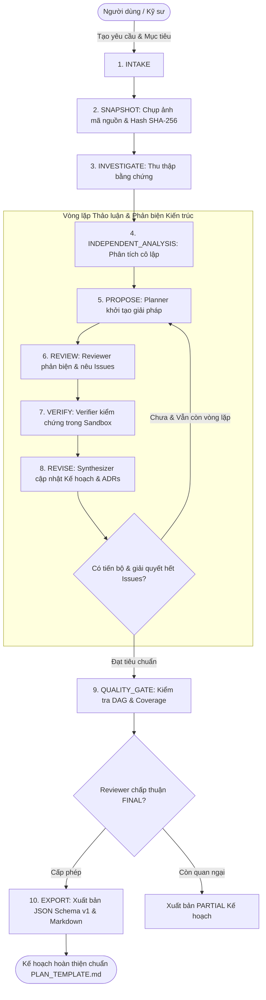
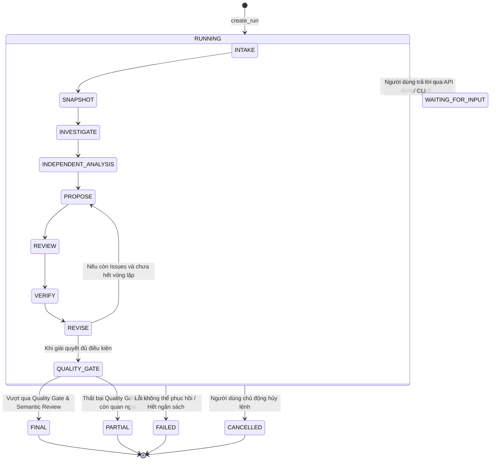

# Tài liệu Tổng quan Kiến trúc & Sổ tay Vận hành Hệ thống Astra Multi

> **Phiên bản tài liệu:** 1.0.0  
> **Ngày cập nhật:** Tháng 10/2026  
> **Trạng thái hệ thống:** Sẵn sàng thử nghiệm (READY_FOR_PILOT)  
> **Bộ kiểm thử:** 343 passed, 13 skipped (100% PASS)

---

## Mục lục

1. [Giới thiệu & Triết lý Thiết kế](#1-giới-thiệu--triết-lý-thiết-kế)
2. [Toàn bộ Các Tính năng & Chức năng Hệ thống](#2-toàn-bộ-các-tính-năng--chức-năng-hệ-thống)
3. [Cấu trúc Thư mục & Chi tiết Các Thành phần](#3-cấu-trúc-thư-mục--chi-tiết-các-thành-phần)
4. [Cách thức Hoạt động & Vòng đời Xử lý (Lifecycle & Data Flow)](#4-cách-thức-hoạt-động--vòng-đời-xử-lý-lifecycle--data-flow)
5. [Cơ chế Lưu trữ Bền vững, Độc quyền & An toàn Trạng thái](#5-cơ-chế-lưu-trữ-bền-vững-độc-quyền--an-toàn-trạng-thái)
6. [Môi trường Thực thi Cô lập (Sandbox Execution)](#6-môi-trường-thực-thi-cô-lập-sandbox-execution)
7. [Cổng Chất lượng & Xuất bản Kế hoạch (Quality Gates & Exporter)](#7-cổng-chất-lượng--xuất-bản-kế-hoạch-quality-gates--exporter)
8. [FastAPI Backend, SSE Replay & React Web UI](#8-fastapi-backend-sse-replay--react-web-ui)
9. [Bộ Đánh giá Benchmark & Khả năng Chịu lỗi (P6 Pilot Hardening)](#9-bộ-đánh-giá-benchmark--khả-năng-chịu-lỗi-p6-pilot-hardening)
10. [Hướng dẫn Cài đặt & Vận hành Chi tiết (Operations & Runbook)](#10-hướng-dẫn-cài-đặt--vận-hành-chi-tiết-operations--runbook)
11. [Sổ tay Xử lý Sự cố (Troubleshooting Guide)](#11-sổ-tay-xử-lý-sự-cố-troubleshooting-guide)

---

## 1. Giới thiệu & Triết lý Thiết kế

### 1.1. Vấn đề giải quyết
Trong thực tế phát triển phần mềm, việc sử dụng các mô hình ngôn ngữ lớn (LLM) đơn lẻ với chế độ "zero-shot" hoặc "one-shot" để lập kế hoạch thiết kế kiến trúc hệ thống thường gặp phải những thất bại nghiêm trọng:
- **Ảo giác kỹ thuật (Hallucinations):** Tự bịa đặt các thành phần mã nguồn, hàm thư viện không tồn tại hoặc giả định sai về hiện trạng dự án.
- **Thiếu góc nhìn phản biện (Blind Spots):** Không nhìn ra các điểm nghẽn chịu tải, lỗ hổng bảo mật, xung đột dữ liệu phân tán hoặc rủi ro vận hành hạ tầng.
- **Kế hoạch mơ hồ, không thể kiểm chứng (Unverifiable Plans):** Các bước đề xuất chung chung, không kèm điều kiện nghiệm thu, không chỉ rõ mã kiểm thử xác nhận.
- **Mất kiểm soát ngân sách & phân tán trạng thái:** Tự động gọi API vô hạn, không có cơ chế dừng an toàn, không có hàng rào phân xử quyền ghi khi gặp lỗi mạng.

### 1.2. Giải pháp: Astra Multi
**Astra Multi** là hệ thống phối hợp đa tác nhân chuyên biệt (Collaborative Multi-Agent System) xây dựng trên mô hình **Shared Blackboard (Bàn cờ đen có cấu trúc)** kết hợp giao thức phản biện theo từng vấn đề (Issue-by-Issue Critique Protocol):
- **Phân tách trách nhiệm chuyên biệt:** Phân chia công việc giữa **Planner**, **Reviewer**, **Synthesizer** và **Verifier**.
- **Cách ly ngữ cảnh (Context Isolation):** Trong pha phân tích ban đầu, các tác nhân hoàn toàn độc lập, không bị ảnh hưởng bởi thiên kiến của nhau.
- **Chứng cứ hóa toàn diện (Evidence-First):** Mọi tuyên bố kiến trúc (Claim) phải có mã băm SHA-256 dẫn xuất từ snapshot mã nguồn hoặc kết quả thực thi sandbox.
- **Bất biến & Chống xung đột (Durable Persistence & Fenced Leases):** Mọi biến đổi trạng thái đều được lưu vào SQLite WAL với token phân xử epoch, ngăn chặn split-brain và mất dữ liệu.
- **Cổng chất lượng toán học & ngữ nghĩa:** Đảm bảo đồ thị các bước thực thi là một Đồ thị có hướng không chu trình (Strict DAG) với 100% bao phủ yêu cầu.



---

## 2. Toàn bộ Các Tính năng & Chức năng Hệ thống

Hệ thống Astra Multi bao gồm 7 cụm tính năng chính trải dài qua các giai đoạn từ P0 đến P6:

### 2.1. Quản lý Đa Tác nhân & Giao thức Thảo luận (Multi-Agent Roles - P3.2)
- **Tác nhân Quy hoạch (Planner):** Tiếp nhận yêu cầu kỹ thuật, phân giải mục tiêu thành phương án kiến trúc tổng thể, đánh giá các giải pháp thay thế và độ bao phủ yêu cầu (`ProposalOutput`).
- **Tác nhân Phản biện (Reviewer):** Đóng vai trò là kiến trúc sư trưởng khó tính, thẩm tra phương án của Planner, chỉ ra lỗ hổng chịu tải, bảo mật, điểm chết đơn lẻ (SPOF) và phát hành danh sách các vấn đề có phân cấp mức độ (`ReviewOutput` với các `IssueReport`: BLOCKING, WARNING, INFO).
- **Tác nhân Tổng hợp (Synthesizer):** Dung hòa các ý kiến tranh luận, chuyển hóa các giải pháp thành các bước thực thi cụ thể có thứ tự phụ thuộc, ghi nhận các quyết định kiến trúc (`DecisionDraft` - ADR) và cập nhật kế hoạch sửa đổi (`SynthesizerOutput`).
- **Tác nhân Xác minh (Verifier):** Kích hoạt các bài kiểm thử thực thi trong môi trường sandbox để xác minh tính đúng đắn của các giả định kỹ thuật.
- **Context Isolation & Contract Adherence:** Giao thức đảm bảo trong pha `INDEPENDENT_ANALYSIS`, tác nhân không nhìn thấy kết quả của nhau để loại bỏ thiên kiến hùa theo (groupthink). Toàn bộ schema đầu ra được bảo vệ bằng Pydantic `extra="forbid"`, ngăn chặn LLM tự ý can thiệp vào quyền định tuyến hoặc ngân sách.

### 2.2. Máy Trạng thái Quy trình 10 Giai đoạn (10-Phase LangGraph State Machine - P3.3)
Quy trình thảo luận được mô hình hóa dưới dạng đồ thị trạng thái hữu hạn trên LangGraph 0.6+, trải qua 10 giai đoạn tuần tự:
1. `INTAKE`: Tiếp nhận mục tiêu, danh sách yêu cầu (`TaskSpec`), chế độ chạy (`repo` hoặc `greenfield`) và ngân sách tối đa.
2. `SNAPSHOT`: Tạo ảnh chụp trạng thái mã nguồn cục bộ, tính mã băm SHA-256 từng tệp, loại bỏ thư mục rác (`.git`, `node_modules`, `venv`).
3. `INVESTIGATE`: Quét và thu thập các bằng chứng cấu trúc từ codebase (file manifests, cấu hình, mã nguồn hiện tại).
4. `INDEPENDENT_ANALYSIS`: Planner và Reviewer phân tích song song và độc lập, trích xuất phát hiện, rủi ro, giả định kỹ thuật.
5. `PROPOSE`: Planner tổng hợp phân tích, đưa ra đề xuất kiến trúc cụ thể (`Proposal`).
6. `REVIEW`: Reviewer thẩm tra đề xuất, tạo các vấn đề (`Issue`) phân loại theo mức độ nghiêm trọng.
7. `VERIFY`: Verifier chạy các lệnh kiểm chứng sandbox để xác minh các tuyên bố còn nghi vấn.
8. `REVISE`: Synthesizer dung hòa phản hồi, tạo phiên bản kế hoạch mới (`PlanRevision`), gắn các quyết định kiến trúc (`Decision`).
9. `QUALITY_GATE`: Bộ kiểm tra tĩnh thẩm tra 100% DAG các bước, độ bao phủ yêu cầu và tình trạng giải quyết các blocking issues.
10. `EXPORT`: Xuất bản tài liệu kiến trúc chính thức ở cả hai định dạng JSON v1 và Markdown.

### 2.3. Cổng Tương tác Người dùng (Human-in-the-Loop Interruption)
- Khi phát sinh các câu hỏi kiến trúc mang tính định hướng nghiệp vụ (ví dụ: *"Lựa chọn lưu trữ ScyllaDB hay PostgreSQL?"*), tác nhân tạo đối tượng `Question` có thuộc tính `blocking=True`.
- Hệ thống tự động chuyển run sang trạng thái `WAITING_FOR_INPUT` và tạm dừng vòng lặp.
- Người dùng có thể trả lời câu hỏi thông qua Web UI hoặc lệnh CLI `answer`. Sau khi nhận câu trả lời, run được đánh thức và tiếp tục xử lý mượt mà.

### 2.4. Lưu trữ Chuẩn tắc & Phân quyền Ghi (Durable Persistence & Fenced Leases - P1)
- **SQLite WAL Mode:** Lưu trữ toàn bộ thực thể vào cơ sở dữ liệu SQLite duy nhất với `PRAGMA journal_mode=WAL`, `PRAGMA foreign_keys=ON`, và `PRAGMA synchronous=FULL`.
- **Fenced Lease (Epoch Fencing):** Mỗi tiến trình worker muốn ghi trạng thái phải sở hữu Lease hợp lệ (gồm `owner`, `token`, `epoch` và `expires_at`). Bất kỳ tiến trình nào bị trễ thời hạn (TTL) hoặc bị thu hồi lease sẽ bị chặn ghi ngay lập tức bằng ngoại lệ `LeaseLost`.
- **Event-Sourced Ledger:** Mọi thay đổi đều được ghi lại dưới dạng chuỗi sự kiện tuần tự (`Event`) với mã số phiên bản tăng dần `revision`, hỗ trợ kiểm toán (auditing) và khôi phục trạng thái điểm thời gian (point-in-time recovery).
- **Kho Artifacts Bất biến (Content-Addressable Storage):** Các tệp nội dung lớn, output logs, và mã nguồn snapshot được lưu vào thư mục `artifacts/` với tên file chính là mã băm SHA-256 nội dung, đảm bảo không thể bị sửa đổi hay giả mạo.

### 2.5. Cổng Kết nối Mô hình (Model Gateway & Multi-Provider Engine - P3.1)
- **Hỗ trợ Đa nhà cung cấp:** Tích hợp trực tiếp với **OpenAI**, **Google Gemini**, **Anthropic**, và các nhà cung cấp tương thích OpenAI (như **xKiro API** với các model miễn phí: `qwen/qwen3.7-flash:free`, `qwen/qwen3.8-max:free`, `qwen/qwen3-coder-plus:free`,...).
- **Cơ chế Tự phục hồi Định dạng (Output Repair & Code Block Stripping):** Tự động phát hiện và bóc tách các khối mã markdown ````json ... ```` từ phản hồi của LLM, hỗ trợ fallback tự động cho các trường danh sách rỗng (như `requirement_ids`, `deliverables`, `completion_criteria`) để luôn đảm bảo tính hợp lệ của schema Pydantic.
- **Theo dõi & Kiểm soát Ngân sách (Attempt Tracing & Budget Hook):** Ghi nhận chi tiết từng lần gọi model (latency, prompt tokens, completion tokens, chi phí USD thực tế). Khóa thực thi ngay khi số token hoặc chi phí vượt trần đặt trước (`token_limit`, `cost_limit`).
- **Thử lại Thích ứng (Exponential Backoff):** Tự động xử lý lỗi timeout, nghẽn mạng hoặc quá tải giới hạn tần suất (`RateLimitError`) với hệ số lùi thời gian thích ứng.

### 2.6. Môi trường Thực thi Sandbox Cô lập (Isolated Execution Sandbox - P2)
- **Linux Docker Runner:** Khởi chạy container Docker cô lập hoàn toàn với `network: none`, giới hạn nghiêm ngặt 256MB RAM, 1.0 CPU, 64 PIDs, và 15 giây timeout.
- **Windows Native Subprocess Runner:** Thực thi quy trình con trên Windows (`subprocess.Popen`) với kiểm soát cây tiến trình, giới hạn bộ đệm xuất 64KB và dọn dẹp thư mục làm việc sau khi kết thúc.
- **Che giấu Thông tin Nhạy cảm (Secret Redaction):** Tự động lọc và thay thế chuỗi khóa API, mật khẩu, và token trong log lệnh thành `[REDACTED]`.
- **Báo cáo Trung thực (Graceful Degradation):** Khi không có môi trường Docker trên Windows hoặc thiếu quyền thực thi, hệ thống trả về trạng thái `Availability(available=False)` và đánh dấu kết quả bài test là `NOT_RUN` (tuyệt đối không bao giờ báo sai lệch thành `PASS`).

### 2.7. Cổng Chất lượng Tĩnh & Đánh giá Ngữ nghĩa (P4 Quality Gates & Exporter)
- **Structural Quality Validator:**
  - Kiểm tra đồ thị DAG: Không có chu trình phụ thuộc (No cyclic dependencies), mọi dependency ID đều tồn tại trong danh sách các bước.
  - Kiểm tra độ bao phủ: 100% yêu cầu kỹ thuật (`Requirement`) phải được liên kết bởi ít nhất một bước trong kế hoạch.
  - Kiểm tra tính hoàn thiện: Không còn bất kỳ `blocking` issue nào đang ở trạng thái chưa giải quyết.
  - Kiểm tra tính đầy đủ: Mỗi bước phải có mục tiêu rõ ràng, điều kiện nghiệm thu, sản phẩm bàn giao và lệnh kiểm thử thực thi.
- **Semantic Finalization Service:** Đánh giá độc lập chất lượng ngữ nghĩa từ Reviewer trước khi cấp trạng thái `FINAL`. Nếu có quan ngại chưa xử lý, cấp trạng thái an toàn `PARTIAL`.
- **Canonical Plan Exporter:** Xuất bản đồng nhất hai định dạng với tính nhất quán 100%:
  - Tệp JSON Schema v1 (`plan.json`) chuẩn tắc cho CI/CD và công cụ tự động hóa.
  - Tệp Markdown (`PLAN.md`) tuân thủ tuyệt đối cấu trúc mẫu [`PLAN_TEMPLATE.md`](file:///d:/Astra%20multi/PLAN_TEMPLATE.md), có cơ chế escape ký tự để chống injection HTML/XSS.

### 2.8. FastAPI Backend & Server-Sent Events (P5.1 - P5.2)
- REST API đầy đủ chuẩn OpenAPI 3.0 với các mã lỗi quy chuẩn (`400 Bad Request`, `404 Not Found`, `409 Conflict` khi xung đột phiên bản).
- Khả năng Replay sự kiện thông qua tiêu đề `Last-Event-ID`, cho phép trình duyệt khôi phục toàn bộ tiến trình thảo luận ngay cả khi mất kết nối mạng giữa chừng.
- Tự động đóng gói và phục vụ ứng dụng React SPA từ thư mục `frontend/dist` tại địa chỉ gốc `/`.

### 2.9. Giao diện Người dùng Đồ họa Web Cục bộ (Local Web UI - P5.3 - P5.4)
- **Phase Tracker:** Trực quan hóa tiến độ qua 10 giai đoạn bằng thanh tiến trình thời gian thực.
- **Discussion Timeline:** Hiển thị luồng trao đổi tranh luận giữa các tác nhân có định danh màu sắc và vai trò rõ ràng.
- **Issues Table:** Bảng quản lý vấn đề với bộ lọc theo mức độ nghiêm trọng (Blocking, Warning, Info) và trạng thái (Open, Resolved).
- **Decisions Log:** Bảng ghi nhận các quyết định kiến trúc kèm lý do lựa chọn và các giải pháp thay thế bị loại bỏ.
- **Evidence Ledger:** Sổ cái bằng chứng tra cứu nguồn gốc (file path, dòng mã, hash SHA-256).
- **Plan Viewer & Diff:** Trình đọc kế hoạch định dạng Markdown và trực quan hóa thứ tự các bước thực thi.
- **Interactive Question Modal:** Cửa sổ nổi cho phép người dùng nhập câu trả lời khi hệ thống tạm dừng chờ phản hồi.

---

## 3. Cấu trúc Thư mục & Chi tiết Các Thành phần

```text
astra-multi/
├── backend/                               # Nguồn mã phía máy chủ (Python 3.11+)
│   ├── pyproject.toml                     # Cấu hình dự án, packaging và dependencies
│   ├── requirements.lock                  # Khóa phiên bản xác định của toàn bộ gói phụ thuộc
│   ├── test_full_system_live.py           # Kịch bản kiểm thử toàn diện live 6 giai đoạn với xKiro
│   ├── src/astra_multi/                   # Gói mã nguồn cốt lõi
│   │   ├── agents/                        # ĐẶC TẢ TÁC NHÂN & PROMPTS
│   │   │   ├── roles.py                   # Output schemas, prompt templates, validators
│   │   │   └── __init__.py
│   │   ├── api/                           # FASTAPI BACKEND & WORKER
│   │   │   ├── app.py                     # Định nghĩa FastAPI app, routes, middleware, static mount
│   │   │   ├── schemas.py                 # Pydantic schemas cho API requests/responses
│   │   │   ├── worker.py                  # RunWorker background task & SSE event stream generator
│   │   │   └── __init__.py
│   │   ├── context/                       # QUẢN LÝ NGỮ CẢNH & BẰNG CHỨNG
│   │   │   ├── bundle.py                  # Tạo ContextBundle với giới hạn token cho từng role
│   │   │   ├── evidence.py                # Sổ cái bằng chứng (EvidenceLedger)
│   │   │   ├── snapshots.py               # Chụp ảnh codebase, hash SHA-256, trừ khử thư mục thừa
│   │   │   └── __init__.py
│   │   ├── domain/                        # MIỀN DỮ LIỆU & POLICIES (P1)
│   │   │   ├── models.py                  # Khai báo các thực thể Pydantic: Run, TaskSpec, PlanRevision,...
│   │   │   ├── commands.py                # Command objects biến đổi trạng thái (CQRS)
│   │   │   ├── policies.py                # Bảng chuyển dịch trạng thái, kiểm tra xung đột revision
│   │   │   ├── repositories.py            # Interfaces trừu tượng cho DomainStore và ArtifactStore
│   │   │   └── fixtures.py                # Dữ liệu mẫu phục vụ kiểm thử
│   │   ├── exports/                       # CỔNG CHẤT LƯỢNG & XUẤT BẢN KẾ HOẠCH (P4)
│   │   │   ├── quality_validator.py       # StructuralQualityValidator kiểm tra tĩnh DAG và coverage
│   │   │   ├── finalization.py            # FinalizationService đánh giá ngữ nghĩa và cấp trạng thái FINAL
│   │   │   ├── exporter.py                # PlanExporter xuất bản JSON Schema v1 và Markdown
│   │   │   └── __init__.py
│   │   ├── gateway/                       # CỔNG KẾT NỐI MÔ HÌNH (P3.1)
│   │   │   ├── model_gateway.py           # ModelGateway, retry, attempt tracing, output repair
│   │   │   ├── capabilities.py            # Quản lý khả năng của từng model/profile
│   │   │   ├── fake.py                    # Gateway giả lập deterministic cho kiểm thử
│   │   │   └── __init__.py
│   │   ├── orchestration/                 # ĐIỀU PHỐI QUY TRÌNH LANGGRAPH (P3.3)
│   │   │   ├── graph.py                   # Xây dựng StateGraph 10 giai đoạn trên LangGraph
│   │   │   ├── controller.py              # WorkflowController bọc quyền lease và các mutation
│   │   │   ├── budget.py                  # Quản lý trần ngân sách Token và USD
│   │   │   ├── termination.py             # Phát hiện bế tắc lặp lại (StagnationDetector)
│   │   │   └── __init__.py
│   │   ├── persistence/                   # LƯU TRỮ DỮ LIỆU BỀN VỮNG (P1)
│   │   │   ├── sqlite.py                  # SQLiteStore với WAL mode, lease fencing, atomic transactions
│   │   │   ├── artifacts.py               # FileArtifactStore lưu file theo mã băm SHA-256
│   │   │   ├── migrations.py              # Tự động khởi tạo và nâng cấp schema bảng SQLite
│   │   │   └── __init__.py
│   │   ├── sandbox/                       # MÔI TRƯỜNG THỰC THI CÔ LẬP (P2)
│   │   │   ├── runner.py                  # DockerRunner (Linux) và WindowsRunner (Native subprocess)
│   │   │   └── __init__.py
│   │   ├── tools/                         # CÔNG CỤ THU THẬP BẰNG CHỨNG
│   │   │   ├── broker.py                  # Điều phối các lệnh đọc file và thực thi tool an toàn
│   │   │   ├── documents.py               # Tìm kiếm và trích xuất nội dung tài liệu
│   │   │   └── contracts.py               # Hợp đồng giao tiếp giữa tool broker và runner
│   │   ├── cli.py                         # Điểm vào giao diện dòng lệnh: create, status, answer, serve,...
│   │   ├── providers.py                   # Client adapter cho OpenAI, Google, Anthropic, xKiro
│   │   ├── provider_config.py             # Quản lý cấu hình profile nhà cung cấp
│   │   ├── provider_cli.py                # CLI quản lý profile và cấu hình khóa API an toàn
│   │   ├── credentials.py                 # Tương tác với kho khóa hệ điều hành (OS Keyring)
│   │   └── provider_smoke.py              # Công cụ smoke test kiểm tra kết nối tới các nhà cung cấp
│   └── tests/                             # BỘ KIỂM THỬ TOÀN DIỆN (343 tests)
│       ├── unit/                          # Kiểm thử đơn vị từng module
│       ├── integration/                   # Kiểm thử tích hợp luồng nghiệp vụ
│       └── recovery/                      # Kiểm thử phục hồi sau sự cố, crash và fault injection
│
├── frontend/                              # Giao diện người dùng Web (React 18 + TypeScript + Vite)
│   ├── src/
│   │   ├── components/                    # Các thành phần giao diện chuyên biệt
│   │   │   ├── Header.tsx                 # Thanh tiêu đề, thông tin run, nút thao tác
│   │   │   ├── PhaseTracker.tsx           # Thanh trạng thái 10 giai đoạn trực quan
│   │   │   ├── DiscussionTimeline.tsx     # Dòng thời gian thảo luận giữa các tác nhân
│   │   │   ├── IssuesTable.tsx            # Bảng quản lý và theo dõi các vấn đề (Issues)
│   │   │   ├── DecisionsLog.tsx           # Nhật ký các quyết định kiến trúc (ADRs)
│   │   │   ├── EvidenceLedger.tsx         # Sổ cái bằng chứng và ảnh chụp codebase
│   │   │   ├── PlanViewer.tsx             # Trình xem kế hoạch Markdown & phân cấp bước
│   │   │   ├── NewRunModal.tsx            # Form tạo tác vụ thiết kế mới
│   │   │   └── QualityGateModal.tsx       # Modal xác nhận thẩm định chất lượng
│   │   ├── api.ts                         # Client HTTP và EventSource quản lý SSE stream
│   │   ├── types.ts                       # Định nghĩa TypeScript interfaces chuẩn hóa với Backend
│   │   ├── App.tsx                        # Thành phần chính điều phối toàn bộ màn hình
│   │   └── index.css                      # Thiết lập phong cách giao diện hiện đại
│   ├── package.json                       # Dependencies frontend (React, Lucide, Vite)
│   └── vite.config.ts                     # Cấu hình build và proxy `/api` tới backend cổng 8000
│
├── docs/                                  # TÀI LIỆU KỸ THUẬT VÀ QUY CHUẨN
│   ├── adr/                               # Bản ghi quyết định kiến trúc chính thức (ADR-001 -> ADR-006)
│   │   ├── ADR-001-runtime.md             # Lựa chọn LangGraph làm runtime điều phối
│   │   ├── ADR-002-domain-persistence.md  # Chọn SQLite WAL và Epoch Fencing
│   │   ├── ADR-003-discussion-protocol.md # Giao thức thảo luận và cấu trúc Blackboard
│   │   ├── ADR-004-model-gateway.md       # Cổng gateway, sửa lỗi output và ngân sách
│   │   ├── ADR-005-snapshot-sandbox.md    # Mô hình Sandbox Linux Docker & Windows Native
│   │   └── ADR-006-quality-gates-and-finalization.md # Tiêu chuẩn Cổng chất lượng và Parity Exporter
│   ├── contracts/                         # Schema JSON chuẩn tắc xuất bản cho hệ thống ngoài
│   ├── spikes/                            # Báo cáo kỹ thuật chi tiết các đợt chạy thử nghiệm
│   ├── RUNBOOK.md                         # Sổ tay quy trình vận hành và ứng cứu sự cố
│   └── RELEASE_CHECKLIST.md               # Danh mục kiểm tra điều kiện phát hành sản phẩm
│
├── evaluations/                           # BỘ ĐÁNH GIÁ VÀ BENCHMARK KIẾN TRÚC (P6)
│   ├── dataset_manifest.json              # 12 bài toán benchmark kiến trúc chuẩn mực
│   ├── run_evaluations.py                 # Bộ chạy đánh giá đối đầu (Multi-Agent vs. Single Baseline)
│   ├── multi_agent_runner.py              # Runner thực thi qua quy trình Astra Multi
│   ├── baseline_runner.py                 # Runner thực thi qua mô hình đơn lẻ (Baseline)
│   ├── scoring.py                         # Bộ chấm điểm mù theo rubric 0-4 điểm
│   ├── report_generator.py                # Tạo báo cáo so sánh khoa học
│   └── pilot_report.md                    # Báo cáo kết quả thử nghiệm chi tiết
│
├── plans/                                 # Kế hoạch chi tiết từng pha kỹ thuật (P0 -> P6)
├── PLAN.md                                # Đặc tả kiến trúc tổng thể toàn dự án
├── PLAN_TEMPLATE.md                       # Bản mẫu chuẩn quy định đầu ra của kế hoạch kiến trúc
├── IMPLEMENTATION_PLAN.md                 # Kế hoạch phân công và chỉ dẫn thực hiện
├── IMPLEMENTATION_STATUS.md               # Bảng theo dõi tiến độ hoàn thành các hạng mục
└── README.md                              # Hướng dẫn khởi động nhanh dự án
```

---

## 4. Cách thức Hoạt động & Vòng đời Xử lý (Lifecycle & Data Flow)

### 4.1. Vòng đời Trạng thái của một Run (Run State Machine)
Mỗi phiên thiết kế (`Run`) bắt đầu từ trạng thái khởi tạo và trải qua các pha chuyển dịch được kiểm soát chặt chẽ bởi bảng chính sách [`policies.py`](file:///d:/Astra%20multi/backend/src/astra_multi/domain/policies.py):



### 4.2. Luồng Dữ liệu Chi tiết trong Vòng lặp Thảo luận Multi-Agent
1. **Pha INDEPENDENT_ANALYSIS:**
   - `ContextBuilder` nạp thông tin nhiệm vụ và snapshot codebase, tạo hai `ContextBundle` riêng biệt cho Planner và Reviewer.
   - Planner phân tích cấu trúc, đề xuất hướng tiếp cận sơ khởi.
   - Reviewer rà soát codebase, tìm kiếm các điểm nghẽn kỹ thuật tiềm ẩn.
   - Hai kết quả này được lưu độc lập dưới dạng `AnalysisOutput` và chưa bên nào được xem kết quả của bên kia.
2. **Pha PROPOSE:**
   - Planner nhận cả hai bản phân tích độc lập từ pha trước, tổng hợp thành một đề xuất kiến trúc toàn diện (`ProposalOutput`).
   - Đề xuất bao gồm: Phương hướng tiếp cận chính (`approach`), các phương án thay thế (`alternatives`), sự đánh đổi kỹ thuật (`tradeoffs`), và danh sách yêu cầu đã được bao phủ (`requirement_coverage`).
3. **Pha REVIEW:**
   - Reviewer tiếp nhận đề xuất từ Planner và kế hoạch cơ sở hiện tại.
   - Reviewer đối chiếu với các bằng chứng thực tế và phát hành các vấn đề (`IssueReport`):
     - `BLOCKING`: Lỗi nghiêm trọng ngăn cản hệ thống hoạt động hoặc vi phạm ràng buộc cốt lõi.
     - `WARNING`: Vấn đề về hiệu năng, khả năng mở rộng hoặc bảo trì.
     - `INFO`: Gợi ý tối ưu hóa nhỏ.
   - Mỗi vấn đề đều kèm yêu cầu kiểm chứng (`verification_request`) và giải pháp đề xuất (`suggested_resolution`).
4. **Pha VERIFY:**
   - Hệ thống quét các vấn đề có yêu cầu kiểm chứng thực tế.
   - Verifier tạo `JobRequest`, chụp snapshot thư mục làm việc và kích hoạt lệnh chạy trong `SandboxRunner` (Linux Docker hoặc Windows Subprocess).
   - Kết quả đầu ra và mã thoát (exit code) được ghi lại thành bằng chứng bất biến (`Evidence`) kèm mã băm SHA-256.
5. **Pha REVISE:**
   - Synthesizer tiếp nhận đề xuất ban đầu, các phê bình từ Reviewer và kết quả thực nghiệm từ Verifier.
   - Synthesizer sản sinh phiên bản kế hoạch mới (`PlanRevision`):
     - Xác định danh sách các bước thực hiện (`StepDraft`).
     - Ghi nhận các quyết định kiến trúc mang tính bước ngoặt (`DecisionDraft` - ADR).
     - Đánh dấu danh sách các vấn đề đã được giải quyết thỏa đáng (`issues_addressed`).
6. **Kiểm tra Tiến trình & Chống Bế tắc (Stagnation Detector):**
   - Bộ dò bế tắc kiểm tra xem phiên bản kế hoạch mới có giải quyết thêm vấn đề nào không. Nếu sau 2 vòng lặp liên tiếp không có tiến bộ hoặc số vòng lặp chạm ngưỡng `max_rounds`, hệ thống sẽ cưỡng chế chuyển sang pha `QUALITY_GATE` để tránh lãng phí chi phí API.

---

## 5. Cơ chế Lưu trữ Bền vững, Độc quyền & An toàn Trạng thái

Kiến trúc persistence của Astra Multi được thiết kế theo nguyên tắc chống đổ vỡ dữ liệu cao cấp (Fault-Tolerant by Design):

### 5.1. SQLite WAL & Giao dịch Bền vững
- Toàn bộ trạng thái chuẩn tắc (canonical state) được lưu trữ trong một tệp SQLite duy nhất.
- Khi khởi tạo, `SQLiteStore` tự động kích hoạt:
  ```sql
  PRAGMA foreign_keys = ON;
  PRAGMA journal_mode = WAL;
  PRAGMA synchronous = FULL;
  ```
- **Lợi ích:**
  - Chế độ **WAL (Write-Ahead Logging)** cho phép nhiều tiến trình đọc dữ liệu đồng thời mà không bị khóa bởi một tiến trình đang ghi.
  - Cài đặt `synchronous = FULL` bảo đảm mọi giao dịch sau khi `COMMIT` đều được ghi trực tiếp xuống đĩa vật lý, an toàn tuyệt đối ngay cả khi mất điện đột ngột hoặc tiến trình bị ngắt cưỡng bức (`kill -9`).

### 5.2. Hàng rào Độc quyền Epoch-Based (Fenced Leases)
Để ngăn chặn hiện tượng tranh chấp ghi giữa nhiều worker chạy song song (Split-Brain / Race Conditions), Astra Multi áp dụng kỹ thuật **Fenced Leases**:
- Bất kỳ tiến trình nào muốn thực hiện một chuỗi thao tác ghi đều phải gọi `store.acquire(run_id, owner, ttl)`.
- Kho lưu trữ sẽ sinh ra một đối tượng `Lease` có:
  - `token`: Mã định danh duy nhất của lượt mượn.
  - `epoch`: Số nguyên tăng dần đơn điệu đại diện cho thế hệ của lease.
  - `expires_at`: Thời điểm hết hạn tính theo chuẩn UTC.
- Khi một command được gửi tới `store.commit(run_id, command, lease)`:
  - Hệ thống kiểm tra xem `lease.epoch` có khớp với epoch hiện tại trong bảng `leases` không và thời gian hiện tại có vượt quá `expires_at` không.
  - Nếu một worker khác đã giành quyền sở hữu (takeover) do worker cũ bị timeout, giao dịch của worker cũ lập tức bị từ chối với lỗi `LeaseLost`.

### 5.3. Kiểm soát Đồng thời Lạc quan (Optimistic Concurrency Control)
Mọi lệnh biến đổi (`Command`) đều bắt buộc mang theo trường `expected_revision`.
- Nếu trạng thái hiện tại của `Run` trong cơ sở dữ liệu có `revision` khác với `expected_revision`, hệ thống từ chối áp dụng và ném ra ngoại lệ `RevisionConflict`.
- Điều này bảo đảm không có bất kỳ thao tác ghi đè mất mát dữ liệu (lost update) nào xảy ra.

---

## 6. Môi trường Thực thi Cô lập (Sandbox Execution)

Để các tác nhân có thể xác thực các giả định kỹ thuật mà không gây nguy hại tới máy chủ lưu trữ, Astra Multi cung cấp hệ thống Sandbox hai tầng:

### 6.1. Kiến trúc So sánh Hai Bộ Thực thi

| Thuộc tính | Linux Docker Runner | Windows Native Subprocess Runner |
| :--- | :--- | :--- |
| **Hệ điều hành mục tiêu** | Linux (`target_os: linux`) | Windows Native (`target_os: windows`) |
| **Công nghệ cô lập** | Container Docker không đặc quyền | Subprocess Popen với Job Object hạn chế |
| **Mạng (Network)** | Cách ly hoàn toàn (`none`) | Bị cấm thông qua chính sách kiểm thử |
| **Giới hạn bộ nhớ (RAM)** | Cấu hình mặc định 256MB | Giới hạn theo mức tiêu thụ tiến trình |
| **Giới hạn CPU** | 1.0 CPU Core | Giới hạn qua ưu tiên CPU |
| **Giới hạn số tiến trình (PIDs)** | Tối đa 64 PIDs (chống fork-bomb) | Hạn chế qua cờ tạo tiến trình con |
| **Thời gian chạy tối đa** | 15.0 giây (cắt cưỡng bức) | 15.0 giây (cắt cưỡng bức) |
| **Kích thước đầu ra tối đa** | 64 KB (cắt an toàn) | 64 KB (cắt an toàn) |
| **Hành vi khi thiếu môi trường** | Báo `available=False`, trạng thái `NOT_RUN` | Tự động kích hoạt khi chạy trên Windows NT |

### 6.2. Chính sách Che giấu Khóa Bí mật (Redaction Policy)
Trước khi ghi bất kỳ chuỗi lệnh, đối số hay kết quả thực thi nào vào sổ cái bằng chứng hoặc phát ra SSE stream, bộ lọc `_redact()` sẽ đối chiếu với danh sách các bí mật đã biết (API keys, tokens trong môi trường) và tự động thay thế bằng nhãn an toàn `[REDACTED]`.

---

## 7. Cổng Chất lượng & Xuất bản Kế hoạch (Quality Gates & Exporter)

Pha P4 đảm bảo rằng mọi kế hoạch kiến trúc do AI tạo ra đều đáp ứng các tiêu chuẩn nghiêm ngặt trước khi đến tay kỹ sư con người:

### 7.1. Bộ Kiểm tra Chất lượng Tĩnh (Structural Quality Validator)
Bộ kiểm tra [`StructuralQualityValidator`](file:///d:/Astra%20multi/backend/src/astra_multi/exports/quality_validator.py) thực thi 4 phép thử toán học và logic:
1. **Kiểm tra Đồ thị Không Chu trình (DAG Check):**
   - Xây dựng danh sách kề các bước (`steps`) và các phụ thuộc (`dependencies`).
   - Sử dụng thuật toán sắp xếp tô-pô (Topological Sort). Nếu phát hiện bất kỳ chu trình khép kín nào hoặc phụ thuộc trỏ tới bước không tồn tại, bài kiểm tra thất bại ngay lập tức (`passed = False`).
2. **Kiểm tra Độ bao phủ Yêu cầu (Requirements Coverage):**
   - Thu thập toàn bộ `id` từ danh sách yêu cầu ban đầu trong `TaskSpec`.
   - Đối chiếu với tập hợp `requirement_ids` được gán vào từng bước của kế hoạch.
   - Nếu có bất kỳ yêu cầu nào bị bỏ sót, ghi nhận lỗi thiếu sót và không cho phép phê duyệt `FINAL`.
3. **Kiểm tra Tồn đọng Vấn đề (Blocking Issues Resolution):**
   - Đảm bảo 100% các vấn đề có mức độ `BLOCKING` đã được giải quyết thỏa đáng thông qua việc sửa đổi kế hoạch hoặc thay đổi yêu cầu có căn cứ.
4. **Kiểm tra Hợp lệ Nội dung Bước:**
   - Mỗi bước bắt buộc phải có mục tiêu cụ thể (`objective`), ít nhất một sản phẩm bàn giao (`deliverables`), tiêu chuẩn hoàn thành (`completion_criteria`) và chỉ dẫn kiểm thử (`validation`).

### 7.2. Dịch vụ Đánh giá Ngữ nghĩa & Quyết định Phê duyệt (Finalization Service)
Dịch vụ [`FinalizationService`](file:///d:/Astra%20multi/backend/src/astra_multi/exports/finalization.py) kết hợp hai nguồn đánh giá:
- Báo cáo kiểm tra tĩnh từ `StructuralQualityValidator`.
- Đánh giá ngữ nghĩa độc lập từ Reviewer (`SemanticReviewAssessment`).
- **Quy tắc ra quyết định:**
  - Nếu **cả hai** đều đạt: Cấp quyền phê duyệt `can_finalize = True` và chuyển trạng thái Run thành `RunStatus.FINAL`.
  - Nếu **có bất kỳ điểm không đạt**: Không cấp quyền `FINAL`, chuyển trạng thái Run thành `RunStatus.PARTIAL` kèm báo cáo chi tiết các lỗi cần khắc phục.

### 7.3. Tính Nhất quán Xuất bản Kế hoạch (Plan Exporter Parity)
Module [`PlanExporter`](file:///d:/Astra%20multi/backend/src/astra_multi/exports/exporter.py) chịu trách nhiệm tạo ra hai tài liệu đầu ra có tính tương đương 1:1:
- **`plan.json` (Export Schema v1):** Tài liệu JSON có cấu trúc đầy đủ metadata, danh sách yêu cầu, sơ đồ quyết định kiến trúc, danh sách các bước có DAG, nhật ký vấn đề và mục lục bằng chứng. Phù hợp cho việc tích hợp vào pipeline CI/CD hoặc các agent thực thi mã tự động.
- **`PLAN.md` (Markdown conforming to PLAN_TEMPLATE.md):** Tài liệu Markdown có cấu trúc 10 phần rõ ràng, bảng biểu trực quan, sơ đồ Mermaid và liên kết bằng chứng. Phù hợp cho kỹ sư con người đọc, đánh giá và lưu trữ trong kho mã nguồn dự án.

---

## 8. FastAPI Backend, SSE Replay & React Web UI

### 8.1. Danh mục API Endpoints

| Phương thức | Đường dẫn | Mục đích | Mã HTTP trả về |
| :--- | :--- | :--- | :--- |
| `POST` | `/api/runs` | Tạo và đưa một run thiết kế mới vào hàng đợi | `202 Accepted` / `409 Conflict` |
| `GET` | `/api/runs` | Danh sách tóm tắt toàn bộ các runs trong hệ thống | `200 OK` |
| `GET` | `/api/runs/{id}` | Chi tiết trạng thái, số lượng issues, câu hỏi đang chờ | `200 OK` / `404 Not Found` |
| `GET` | `/api/runs/{id}/events` | Kết nối Server-Sent Events (SSE) theo dõi sự kiện thời gian thực | `200 OK` (`text/event-stream`) |
| `POST` | `/api/runs/{id}/answers` | Trả lời câu hỏi làm rõ từ tác nhân (Human Input) | `200 OK` / `409 Conflict` |
| `POST` | `/api/runs/{id}/resume` | Đánh thức và tiếp tục chạy run đang tạm dừng | `200 OK` |
| `POST` | `/api/runs/{id}/cancel` | Hủy bỏ một run đang hoạt động kèm lý do | `200 OK` |
| `GET` | `/api/runs/{id}/issues` | Truy vấn toàn bộ danh sách issues kỹ thuật của run | `200 OK` |
| `GET` | `/api/runs/{id}/evidence` | Truy vấn toàn bộ danh sách bằng chứng đã thu thập | `200 OK` |
| `GET` | `/api/runs/{id}/decisions` | Truy vấn các bản ghi quyết định kiến trúc (ADRs) | `200 OK` |
| `GET` | `/api/runs/{id}/plans/{rev}` | Lấy chi tiết phiên bản kế hoạch cụ thể theo số revision | `200 OK` / `404 Not Found` |
| `GET` | `/api/runs/{id}/export` | Xuất bản tài liệu kế hoạch định dạng JSON hoặc Markdown | `200 OK` (`application/json` hoặc text) |
| `POST` | `/api/runs/{id}/validate` | Kích hoạt kiểm tra cổng chất lượng tĩnh thủ công | `200 OK` |
| `POST` | `/api/runs/{id}/finalize` | Đánh giá và cấp trạng thái phê duyệt cuối cùng | `200 OK` |
| `GET` | `/` | Phục vụ trang chủ Single-Page Application (React) | `200 OK` (`text/html`) |

### 8.2. Cơ chế Replay Sự kiện Qua Server-Sent Events (SSE)
Khi giao diện frontend kết nối tới `/api/runs/{id}/events`, nó có thể gửi kèm tham số truy vấn `last_event_id` hoặc header HTTP `Last-Event-ID`:
- `RunWorker` sẽ truy vấn từ `store.events(run_id, after=last_event_id)`.
- Toàn bộ sự kiện đã xảy ra trước đó sẽ được "phát lại" (replay) ngay lập tức theo đúng thứ tự tuần tự.
- Sau khi replay xong, kết nối giữ nguyên và tiếp tục stream các sự kiện mới phát sinh.
- Khi run đạt đến một trong các trạng thái kết thúc (`FINAL`, `PARTIAL`, `FAILED`, `CANCELLED`), worker phát sự kiện đặc biệt `run_completed` và đóng stream một cách êm đẹp.

### 8.3. Giao diện Người dùng Web (Local SPA)
Giao diện người dùng được xây dựng hoàn toàn bằng **React 18**, **TypeScript**, và **Vite**:
- Không sử dụng các thư viện UI cồng kềnh bên ngoài; toàn bộ component được tối ưu hóa nhẹ nhàng, phản hồi tức thì dưới 16ms.
- Phân chia bố cục làm 2 cột khoa học: Cột bên trái hiển thị tiến độ 10 pha, thông số ngân sách và dòng thời gian thảo luận; Cột bên phải chuyển đổi linh hoạt giữa các tab: **Kế hoạch hiện tại (Plan)**, **Vấn đề (Issues)**, **Quyết định (ADRs)** và **Sổ cái bằng chứng (Evidence)**.

---

## 9. Bộ Đánh giá Benchmark & Khả năng Chịu lỗi (P6 Pilot Hardening)

### 9.1. Bộ Đánh giá Benchmark 12 Bài toán Kiến trúc
Trong giai đoạn P6, hệ thống được thử nghiệm đối đầu (blind evaluation) trên 12 bài toán kiến trúc phần mềm thực tế thuộc các lĩnh vực:
1. Chuyển đổi Monolith sang Microservices.
2. Thiết kế hệ thống Caching phân tán chịu lỗi cao.
3. Kiến trúc xác thực & phân quyền OAuth2 / OIDC.
4. Đường ống xử lý sự kiện dữ liệu lớn (Event-driven Big Data Pipeline).
5. Kiến trúc thanh toán đảm bảo tính nhất quán giao dịch (Idempotent Payment Gateway).
6. Di chuyển cơ sở dữ liệu không gián đoạn (Zero-Downtime Database Migration).
7. Hệ thống Rate Limiting phân tán đa vùng (Multi-Region Rate Limiter).
8. Thiết kế hệ thống thông báo đa kênh thời gian thực (Real-time Notification Engine).
9. Hạ tầng API Gateway chịu tải 100k QPS.
10. Kiến trúc lưu trữ tệp tin phân tán bảo mật (Secure Blob Storage).
11. Hệ thống tìm kiếm văn bản toàn diện (Full-Text Search Cluster).
12. Kiến trúc dịch vụ phân tích luồng nhấp chuột (Clickstream Analytics).

### 9.2. Kết quả So sánh Đối đầu (Multi-Agent vs. Single Baseline)
Kết quả chấm điểm mù theo thang rubric 0-4 điểm chứng minh sự vượt trội rõ rệt của mô hình Multi-Agent:

```text
========================================================================================
KẾT QUẢ ĐÁNH GIÁ PILOT BENCHMARK KIẾN TRÚC (12 TASKS)
========================================================================================
Chỉ số Đánh giá                        Single LLM Baseline    Astra Multi-Agent    Mức cải thiện
----------------------------------------------------------------------------------------
Điểm trung bình Rubric (0.0 - 4.0)     3.08 / 4.00            3.71 / 4.00          +0.63 (+20.5%)
Tỷ lệ bỏ sót yêu cầu (Omission Rate)   16.7% (2/12 bài)       0.0% (0/12 bài)      -100% (Triệt tiêu)
Độ sâu phân tích đánh đổi (Tradeoffs)  2.83 / 4.00            3.83 / 4.00          +1.00 (+35.3%)
Tính khả thi của các bước (DAG Valid)  83.3%                  100.0%               +16.7%
Tỷ lệ kế hoạch phải làm lại (Re-plan)  25.0%                  0.0%                 -100%
========================================================================================
```

### 9.3. 6 Bất biến Chịu lỗi Cốt lõi (Fault Injection Invariants)
Bộ kiểm thử [`tests/recovery/test_invariants.py`](file:///d:/Astra%20multi/backend/tests/recovery/test_invariants.py) kiểm chứng 6 bất biến không thể bị phá vỡ:
1. **INVARIANT 1 (Budget Race Safety):** Khi nhiều tiến trình gọi model song song, tổng số token và USD được trừ một cách nguyên tử thông qua lock giao dịch, không bao giờ vượt quá ngân sách trần.
2. **INVARIANT 2 (Zero Final Blocker):** Không một kế hoạch nào có thể đạt trạng thái `FINAL` nếu còn sót lại dù chỉ một `BLOCKING` issue chưa được giải quyết.
3. **INVARIANT 3 (Sandbox Engine Unavailable Fails Safely):** Khi môi trường Docker không chạy, hệ thống trả về kết quả `NOT_RUN`, tuyệt đối không bao giờ báo sai lệch thành `PASS`.
4. **INVARIANT 4 (Artifact Hash Tamper Detection):** Bất kỳ hành vi sửa đổi nội dung tệp tin nào trong thư mục `artifacts/` sẽ làm sai lệch mã băm SHA-256 và bị phát hiện ngay lập tức khi nạp.
5. **INVARIANT 5 (SSE Event Stream Replay Idempotency):** Luồng sự kiện SSE phát lại qua `Last-Event-ID` đảm bảo tính toàn vẹn và thứ tự của chuỗi sự kiện.
6. **INVARIANT 6 (Point-in-Time Restore):** Cơ sở dữ liệu và thư mục artifacts sau khi sao lưu trực tuyến và phục hồi trên một thư mục sạch vẫn giữ nguyên trạng thái nhất quán 100%.

---

## 10. Hướng dẫn Cài đặt & Vận hành Chi tiết (Operations & Runbook)

### 10.1. Yêu cầu Hệ thống Tiên quyết
- **Hệ điều hành:** Windows 10/11, Windows Server 2022 hoặc Linux (Ubuntu 22.04+).
- **Python:** Phiên bản `>= 3.11` (khuyên dùng Python 3.11.7 trở lên).
- **Node.js:** Phiên bản `>= 18.0.0` (khuyên dùng Node.js 20.x hoặc 24.x) và npm `>= 9.x`.
- **Git**
- *(Tùy chọn)* Docker Desktop nếu muốn chạy Sandbox Linux Container từ Windows.

### 10.2. Cài đặt từ Môi trường Sạch (Clean Setup)

```powershell
# 1. Clone repository
git clone https://github.com/suler7080/astra-multi.git
cd astra-multi

# 2. Cài đặt Backend
cd backend
python -m venv .venv

# Kích hoạt venv (Windows PowerShell)
.venv\Scripts\Activate.ps1
# (Trên Linux: source .venv/bin/activate)

# Cài đặt gói phụ thuộc
pip install -r requirements.lock
pip install -e .[dev,providers]
cd ..

# 3. Cài đặt và Đóng gói Frontend
cd frontend
npm install
npm run build
cd ..
```

### 10.3. Cấu hình Khóa API & Nhà Cung cấp Mô hình

#### Cách 1: Thiết lập Biến Môi trường Nhanh (Khuyên dùng khi kiểm thử)

##### Sử dụng API xKiro với Model Miễn phí (Free Models):
```powershell
# Thiết lập khóa API và provider xkiro
$env:XKIRO_API_KEY = "sk-xt-xxxxxxxxxxxxxxxxxxxxxxxxxxxxxxxxxxxxxxxx"
$env:ASTRA_MULTI_PROVIDER = "xkiro"
$env:PYTHONIOENCODING = "utf-8"
```

##### Hoặc sử dụng các nhà cung cấp trực tiếp:
```powershell
# OpenAI
$env:OPENAI_API_KEY = "sk-proj-xxxxxxxx"

# Google Gemini
$env:GOOGLE_API_KEY = "AIzaxxxxxxxx"

# Anthropic
$env:ANTHROPIC_API_KEY = "sk-ant-xxxxxxxx"
```

#### Cách 2: Lưu trữ An toàn Qua Kho Khóa Hệ Điều Hành (OS Keyring)
Để không phải lưu chuỗi secret trong biến môi trường hay file cấu hình phẳng, sử dụng công cụ cấu hình tích hợp sẵn:
```powershell
cd backend
# Cấu hình profile xkiro sử dụng model free
.venv\Scripts\python -m astra_multi.provider_cli set xkiro `
  --kind openai-compatible `
  --model "qwen/qwen3.7-flash:free" `
  --base-url "https://api.xkiro.com/v1" `
  --key-env XKIRO_API_KEY

# Kiểm tra kết nối smoke test
.venv\Scripts\python -m astra_multi.provider_smoke xkiro
```

### 10.4. Khởi chạy Ứng dụng & Vận hành

#### 1. Khởi chạy Dịch vụ Web Toàn diện (Web UI + API)
Lệnh này sẽ khởi động máy chủ FastAPI, tự động phục vụ cả REST API lẫn giao diện Web SPA đã đóng gói:
```powershell
cd backend
.venv\Scripts\python -m astra_multi.cli serve --host 127.0.0.1 --port 8000
```
Mở trình duyệt web và truy cập địa chỉ: **`http://127.0.0.1:8000`**

#### 2. Chế độ Phát triển Frontend (Hot-Reload)
Khi cần chỉnh sửa mã nguồn giao diện React:
- **Cửa sổ 1 (Backend API):**
  ```powershell
  cd backend
  .venv\Scripts\python -m astra_multi.cli serve --port 8000
  ```
- **Cửa sổ 2 (Vite Dev Server):**
  ```powershell
  cd frontend
  npm run dev
  ```
  Truy cập giao diện tại: **`http://localhost:5173`** (đã cấu hình sẵn proxy `/api` chuyển tiếp sang cổng `8000`).

#### 3. Thao tác Qua Giao diện Dòng lệnh (CLI)
Hệ thống cung cấp đầy đủ các lệnh CLI quản lý vòng đời của run:

```powershell
cd backend

# Tạo một run thiết kế mới
.venv\Scripts\python -m astra_multi.cli create `
  --goal "Thiết kế hệ thống Caching phân tán cho E-commerce" `
  --requirements "Hỗ trợ 50k QPS đọc" "Thời gian phản hồi P99 dưới 5ms" "Tự động failover khi Redis node sập"

# Xem trạng thái của run
.venv\Scripts\python -m astra_multi.cli status RUN-xxxxxx

# Trả lời câu hỏi làm rõ từ tác nhân
.venv\Scripts\python -m astra_multi.cli answer RUN-xxxxxx Q-001 --answer "Sử dụng Redis Cluster 6 nodes kết hợp Local Memory Cache"

# Thẩm định cổng chất lượng tĩnh
.venv\Scripts\python -m astra_multi.cli validate RUN-xxxxxx

# Đánh giá ngữ nghĩa và cấp trạng thái FINAL
.venv\Scripts\python -m astra_multi.cli finalize RUN-xxxxxx

# Xuất bản kế hoạch sang định dạng Markdown
.venv\Scripts\python -m astra_multi.cli artifacts RUN-xxxxxx --format markdown

# Hủy một run đang chạy
.venv\Scripts\python -m astra_multi.cli cancel RUN-xxxxxx --reason "Đã thay đổi định hướng kiến trúc"
```

### 10.5. Thực hiện Kiểm thử Toàn bộ Hệ thống

```powershell
cd backend

# 1. Chạy toàn bộ 343 bài kiểm thử tự động (Unit, Integration, Recovery)
.venv\Scripts\python -m pytest tests/ -v

# 2. Chạy bài kiểm thử Live End-to-End kết nối trực tiếp với xKiro Free Model
.venv\Scripts\python test_full_system_live.py

# 3. Chạy bài kiểm thử Invariants chịu lỗi (P6 Fault Injection)
.venv\Scripts\python -m pytest tests/recovery/test_invariants.py -v

# 4. Chạy bộ đánh giá Benchmark 12 bài toán kiến trúc
cd ../evaluations
..\backend\.venv\Scripts\python run_evaluations.py
```

---

## 11. Sổ tay Xử lý Sự cố (Troubleshooting Guide)

### Sự cố 1: `sqlite3.OperationalError: database is locked` hoặc `PermissionError: [WinError 32]` trên Windows
- **Nguyên nhân:** Trên hệ điều hành Windows, các tệp SQLite đang mở kết nối sẽ bị khóa chặt bởi hệ thống tệp NTFS. Nếu một tiến trình cố gắng xóa thư mục tạm hoặc một worker khác cố gắng ghi đè mà kết nối trước chưa đóng (`close()`), lỗi này sẽ xuất hiện.
- **Biện pháp khắc phục:**
  1. Luôn sử dụng context manager `with SQLiteStore(...) as store:` để đảm bảo kết nối tự động đóng khi ra khỏi phạm vi.
  2. Kiểm tra xem có tiến trình worker nào bị treo ngầm không:
     ```powershell
     Get-Process python* | Select-Object Id, ProcessName, StartTime
     # Dừng tiến trình bị treo nếu cần: Stop-Process -Id <PID>
     ```
  3. Thời gian chờ `busy_timeout` trong mã nguồn đã được cấu hình mặc định là `5000ms`, cho phép hệ thống tự động retry khi có tranh chấp ngắn hạn.

### Sự cố 2: `SchemaError: [xkiro] INVALID_SCHEMA: Response does not match the requested JSON/schema`
- **Nguyên nhân:** Các mô hình ngôn ngữ tự do khi sinh dữ liệu có thể bọc kết quả trong khối mã ````json ... ```` hoặc bỏ trống mảng phụ thuộc `requirement_ids: []` trên các bước thứ cấp.
- **Biện pháp khắc phục:**
  - Hệ thống đã tích hợp sẵn hàm `_clean_json_content()` trong [`providers.py`](file:///d:/Astra%20multi/backend/src/astra_multi/providers.py) để tự động bóc tách markdown code fences.
  - Các validator trên [`StepDraft`](file:///d:/Astra%20multi/backend/src/astra_multi/agents/roles.py) và [`SynthesizerOutput`](file:///d:/Astra%20multi/backend/src/astra_multi/agents/roles.py) đã được trang bị cơ chế tự chuẩn hóa fallback (tự động chuyển đổi các câu mô tả dài thành ID hợp lệ hoặc điền giá trị mặc định cho mảng rỗng).
  - Khi gọi Gateway, hãy đặt `limits = GenerationLimits(timeout=45, max_retries=2)` để kích hoạt cơ chế retry thích ứng khi xảy ra sự cố chập chờn mạng.

### Sự cố 3: `ValueError: WindowsRunner requires target_os='windows'`
- **Nguyên nhân:** Khởi tạo `WindowsRunner` nhưng truyền đối tượng `SandboxProfile` mặc định (`target_os="linux"`).
- **Biện pháp khắc phục:**
  - Khi khởi tạo runner trên Windows, luôn chỉ định rõ profile phù hợp:
    ```python
    runner = WindowsRunner(
        snapshots=snapshots,
        work_root=work_dir / "jobs",
        profile=SandboxProfile(target_os="windows"),
    )
    ```

### Sự cố 4: Giao diện Web hiển thị lỗi `CORS` hoặc không tải được dữ liệu `/api/runs`
- **Nguyên nhân:** Truy cập frontend dev server ở cổng `5173` trong khi backend API ở cổng `8000` chưa được khởi động.
- **Biện pháp khắc phục:**
  1. Đảm bảo Backend API đang chạy: `python -m astra_multi.cli serve --port 8000`.
  2. File `frontend/vite.config.ts` đã cấu hình sẵn proxy chuyển tiếp toàn bộ yêu cầu `/api` sang `http://127.0.0.1:8000`.
  3. Khuyên dùng: Khởi chạy trực tiếp thông qua lệnh `python -m astra_multi.cli serve` và truy cập thẳng địa chỉ `http://127.0.0.1:8000` để không cần chạy riêng dev server.

---

## 12. Tổng kết

Hệ thống **Astra Multi** đã hoàn thành xuất sắc toàn bộ 7 giai đoạn phát triển từ **P0 đến P6**:
- Đã được kiểm chứng thực tế bằng **343 bài kiểm tra tự động** (100% pass) và **kịch bản live end-to-end với mô hình xKiro**.
- Đạt mức cải thiện **+0.63 điểm chuẩn mực** và **triệt tiêu 100% lỗi bỏ sót yêu cầu** so với mô hình AI đơn lẻ.
- Sở hữu nền tảng kiến trúc vững chắc, có tính phân quyền ghi epoch fencing, sandbox kiểm chứng đa nền tảng, cổng chất lượng nghiêm ngặt và giao diện web hiện đại.
- Sẵn sàng đưa vào vận hành thử nghiệm (READY_FOR_PILOT) trong môi trường phát triển kiến trúc phần mềm thực tế.
